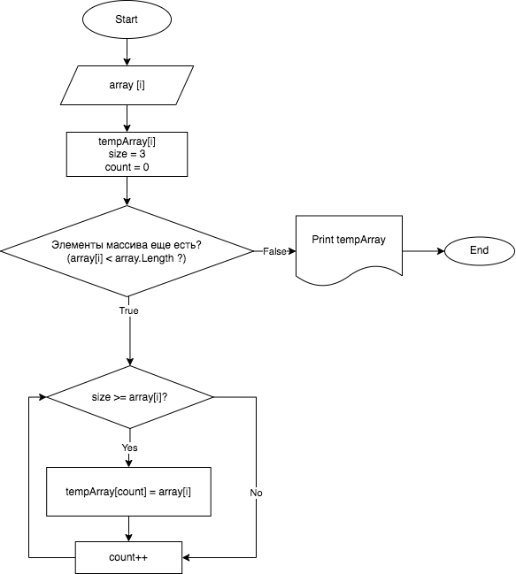

# Итоговая работа.
## Задача: 
Написать программу, которая из имеющегося массива строк формирует новый массив из строк, длина которых меньше, либо равна 3 символам. Первоначальный массив можно ввести с клавиатуры, либо задать на старте выполнения алгоритма. При решении не рекомендуется пользоваться коллекциями, лучше обойтись исключительно массивами.

*Примеры:*

[“Hello”, “2”, “world”, “:-)”] → [“2”, “:-)”]

[“1234”, “1567”, “-2”, “computer science”] → [“-2”]

[“Russia”, “Denmark”, “Kazan”] → []

## Алгоритм:
* Считываем с клавиатуры массив.
* Объявляем второй массив такой же длины, как считали с клавиатуры.
* Создаем метод для проверки выполнения условия (длина массива должна быть равна или меньше 3).
* Если условие (длина = или < 3) выполняется, то элемент массива, введеннного с клавиатуры вносится во второй массив.
* Проходим весь массив с помощью цикла "for" в нашем методе.
* Выводим получившийся массив на экран.

## Блок схема алгоритма

